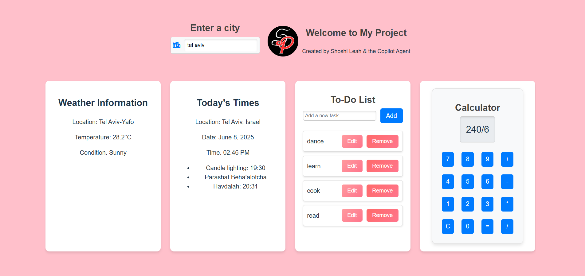

# Project Overview

Welcome to the project repository! This project showcases a variety of features and components, including a calculator, weather updates, and a to-do list.

## About the Developer

**Shoshi Leah Pories**  
Full Stack Developer  
Passionate about creating seamless user experiences and robust web applications.

## Features

- **Calculator**: Perform basic arithmetic operations.
- **Weather Updates**: Get the latest weather information.
- **To-Do List**: Organize your tasks efficiently.
- **Today's Times**: Display current times.

## Preview

Below is a preview of the site:



## Technologies Used

- React
- Vite
- CSS

## Getting Started

1. Clone the repository:
   ```bash
   git clone https://github.com/Shoshi1766/Project-Created-With-Copilot-Agent.git
   ```
2. Install dependencies:
   ```bash
   npm install
   ```
3. Start the development server:
   ```bash
   npm run dev
   ```

## Folder Structure

- **public/**: Contains static assets like images.
- **src/**: Contains source code including components and styles.

## License

This project is licensed under the MIT License.
